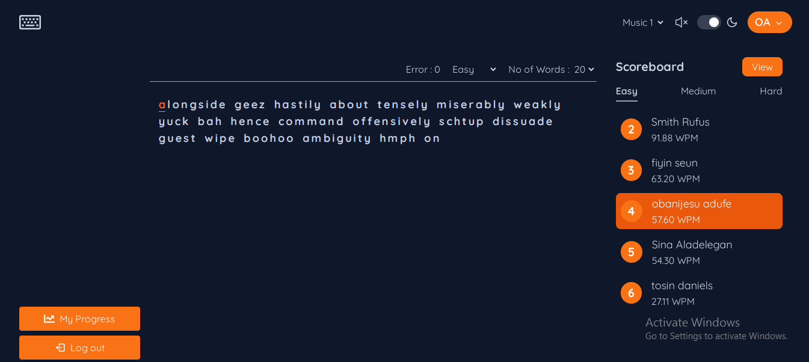

# Typing Application

Growing up, I honed my typing skills with Mavis Beacon Desktop Application. Inspired by my childhood experiences, I've crafted my own typing application with a modern and adaptive design, ensuring a seamless and enjoyable user experience

## Live Project

Explore the live project [here](https://typing-eight-chi.vercel.app/).



## Technologies Used

- **Frontend:** Next.js (written in TypeScript)
- **Backend:** Express.js (written in TypeScript)
- **Database:** MongoDB

## Features

- **Mode Changing:** Switch effortlessly between light and dark modes to suit your preference and reduce eye strain during extended typing sessions.

- **Background Music:** Immerse yourself in a focused typing environment with background music that enhances your flow and concentration.

- **Progress Chart:** Track and visualize your typing progress over time with an interactive chart, providing insights into your speed improvement.

- **Scoreboard:** Compete with others and see where you stand by checking the live scoreboard, showcasing the top typists and their rankings.

## Installation

To run the application locally, follow these steps:

1. Clone the repository:
```
git clone https://github.com/Adufe-Obanijesu/typing-application.git
```
2. Navigate to the root directory:
```
cd typing-application
```

3. Install backend dependencies:
```
npm install
```

4. Move to the client folder:
```
cd client
```

5. Install frontend dependencies:
```
npm install
```

6. If you plan to edit the backend (written in TypeScript), run:
```
npx tsc --watch
```

7. Kickstart the backend server:
```
npm run server
```

8. Move back to the client folder:
```
cd client
```

9. Run the frontend development server:
```
npm run dev
```

## Building the Application

To build the application for deployment:

1. Run:
npm run build


Feel free to contribute, report issues, or provide feedback. Happy typing! 🚀
